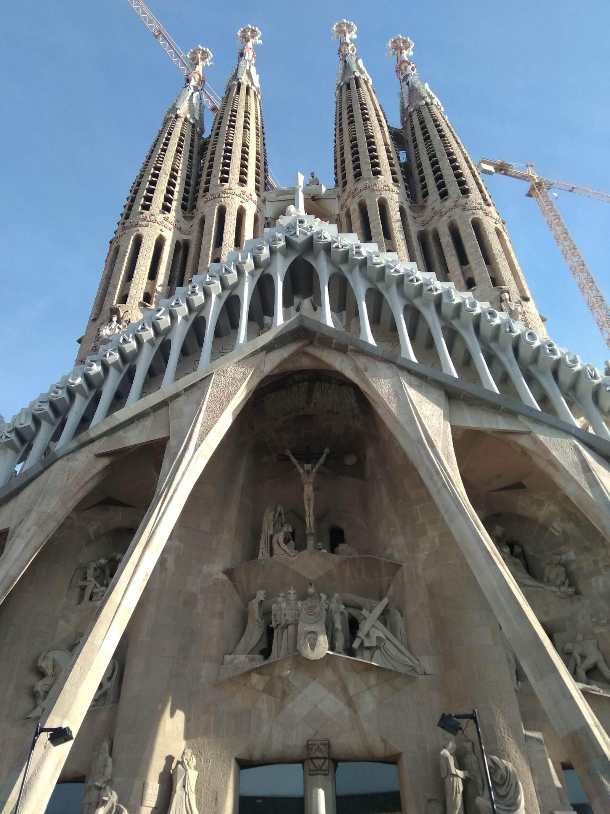
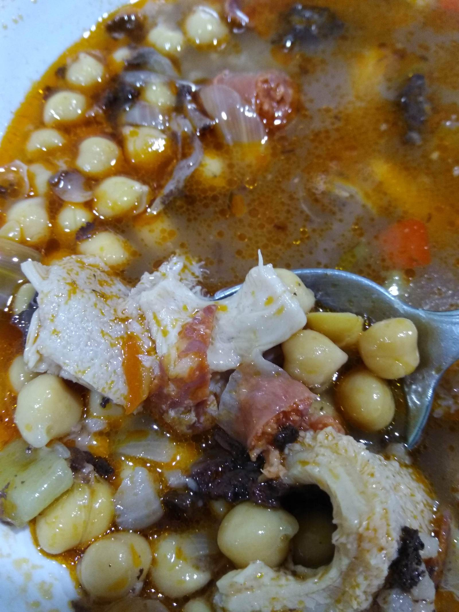

I visited Barcelona with my cousin recently. As one of the most visited 
places on Earth, there's no shortage of general guides
but I promise, mine will be the best you've read so far :).

### How I plan my trips
I've visited and lived in a lot of different cities and to be blunt, 
most are pretty similar. 

> As much as my fellow Melbournians might 
> disagree, I think it's acceptable for international visitors to
> interchangeably pick either Sydney or Melbourne to visit. 

I want to see something new. Something cool. Something unique. 
One tool I find exceedingly useful is [AtlasObscura](https://www.atlasobscura.com/).
This site uses mostly user submitted suggestions to curate a list of
attractions that are strange, interesting or downright bizarre.

I also like tripadvisor's top attraction list and use it to get 
suggestions for each area I might visit. This usually has more of
the mainstream tourist attractions.

The important thing though is to leave enough free time to explore. 
Not everything is documented and it's a lot more fun to be surprised.

#### Sagrada Familia

Arguably the most significant attraction in Barcelona, this Gaudi designed 
church is worth the hype. One of the perks of visiting in December is getting
to visit the cathedral during Christmas Mass for the full experience. Check
the calendar ahead of time, these events occur a few times a month.

_Random note - Barcelona apparently has a tradition of hiding a rude figurine
within nativity scenes called a caganer._

#### Urban Parks

The most famous park is Park Güell, another Gaudi designed attraction. Entrance 
to the park is free but you'll need to pay to enter some areas. I think this
qualifies a bit as a tourist trap, there's not really much to do here. 

Instead, visit Parc del Laberint d'Horta located near the northern edge of the city
to see some interesting sculptures as well as the namesake hedge maze. I was 
fortunately able to meet a local who recommended a guided tour that explained the 
history and stories of this area. 

A park that I walked through almost everyday due to it being close to the center of the city
is Parc de la Ciutadella. It's a great place to see people playing games and there's a number of 
mini-attractions within.

#### Snacks!

People usually think tapas when they think Spain and they'd be right! 
In Catalonia, they call this pica-pica(pronounced like the pokemon).

Quality does vary quite a bit--the ones I tried near the touristy 
Las Ramblas pales in comparison to ones you'd find near the less touristy 
areas like Gracia or Poble Nou.

#### Zaragoza

This is the 5th largest city in Spain. It has quite a different vibe from
Barcelona and is worth a visit if you have the time. The train takes
about 1.5hrs to get there.

I tried some traditional stew that had bits of tripe and blood 
sausage called Garbanzo y Callos.

There was also a Moorish Palace that you can visit. Unfortunately 
age has destroyed a lot of its former beauty.

#### Montserrat

The "Serrated Mountains" is an incredible sight. On top of the mountain, 
there are a number of trails that you can take. Unfortunately the signage is
not the best--make sure you ask at the tourism office for directions. 

_Note: it can get quite cold here._

### Overall Impressions

I had a great time in Barcelona. I think a lot of that has to do with
the fact that I was to meet a few locals who showed me a few things
that I couldn't find in the guides. The people I met were very warm, friendly,
and their sense of humor made interactions very enjoyable. Given the chance,
I would not hesitate to visit again.

_Echo a menos._

